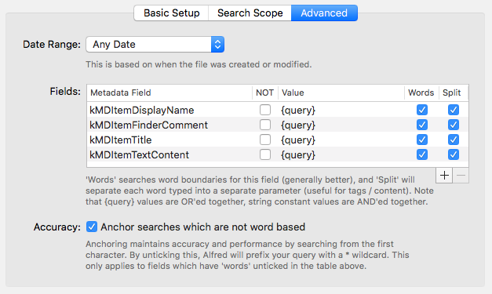
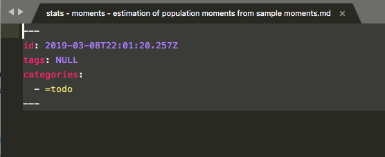
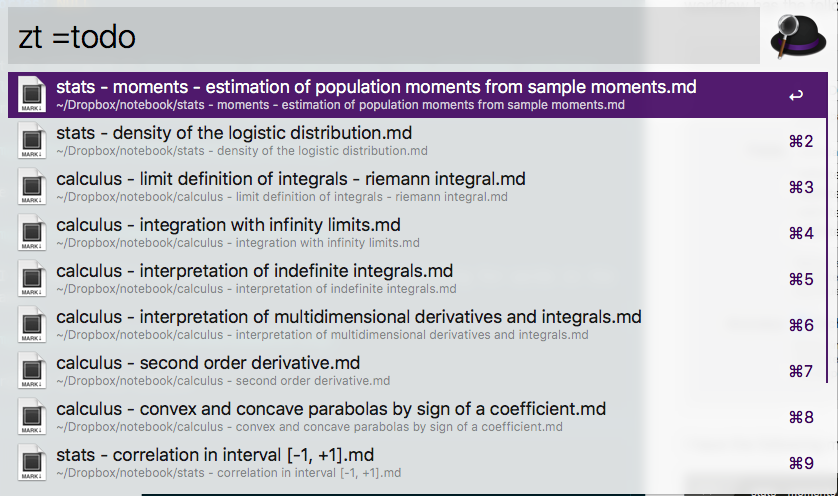

I want to configure a [file filter workflow](https://www.alfredapp.com/help/workflows/inputs/file-filter/) to search both in the filename and it's content. My workflow has the following configuration until now

I have the following markdown file

When I use my workflow to search I get a match when searching for words in the filename

or words in the file content

However, when I combine both, I don't get any results

Is this the intendend behaviour?

I've posted what I hope is a reproducible example [here](https://github.com/fjuniorr/alfred-reprex) with the search scope set to `~/afred-reprex`.

# Links

+ [Reporting problems with workflows](https://www.alfredforum.com/topic/10224-reporting-problems-with-workflows/)
